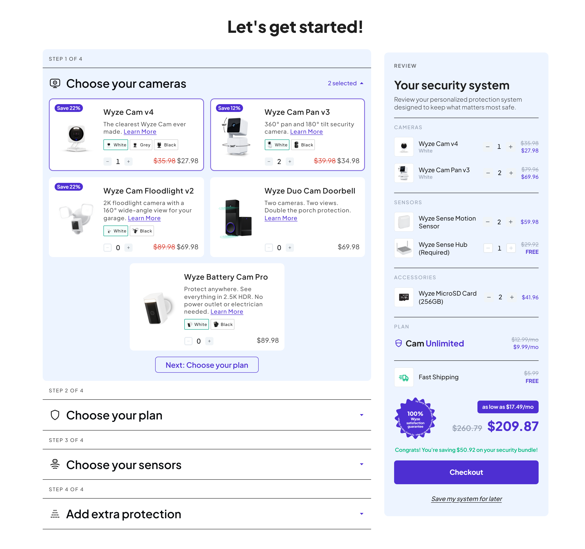
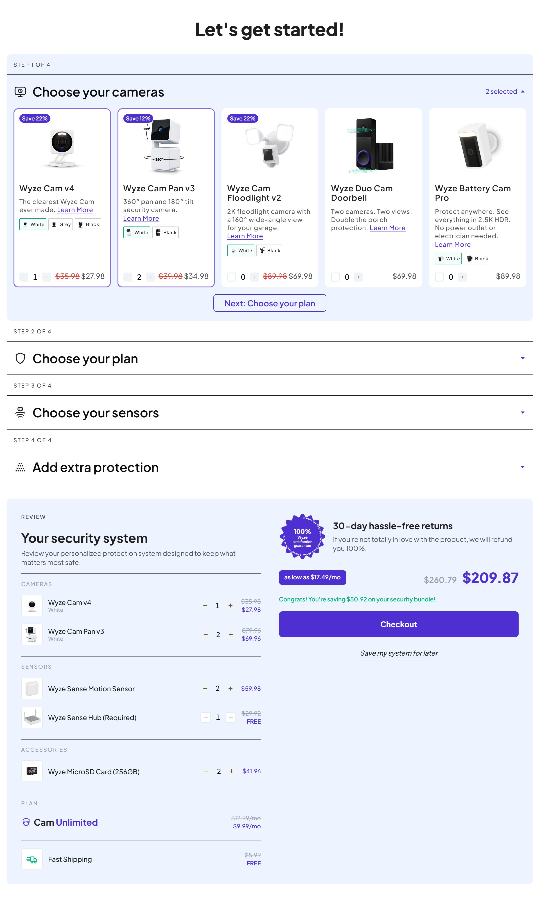
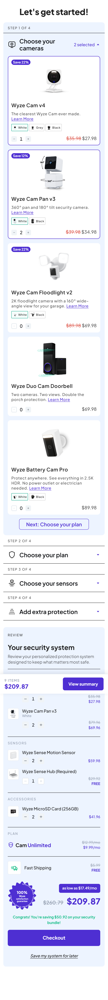

# Bundle Builder

A multi-step security-system bundle builder with a live review panel, built as a React prototype from the provided Figma design.



<details>
<summary>Tablet and mobile</summary>

| Tablet (builder full width) | Mobile |
| --- | --- |
|  |  |

</details>

---

## Running it

Requires Node 18+ (developed on Node 24).

```bash
npm install
npm run dev
```

Then open the URL Vite prints (http://localhost:5173 by default).

That's everything — the app renders from the bundled `data/catalog.json` and needs no backend.

### Scripts

| Script | What it does |
| --- | --- |
| `npm run dev` | Start the app |
| `npm test` | Run the test suite (70 tests) |
| `npm run build` | Typecheck and produce a production build |
| `npm run preview` | Serve the production build |
| `npm run lint` | ESLint, zero-warnings policy |
| `npm run dev:api` | Start the optional catalog API (bonus) |
| `npm run dev:all` | Run the app and the API together |

### Optional: the API bonus

`server/index.mjs` is a ~40-line Express server that serves the *same* `data/catalog.json` the app bundles, so the two can't drift.

```bash
cp .env.example .env   # sets VITE_API_URL=http://localhost:8787/api
npm run dev:all
```

The app prefers the API when `VITE_API_URL` is set and **silently falls back to the bundled copy on any failure**. A bonus should never become a setup requirement.

---

## Architecture

```
data/catalog.json          Single source of truth — products, steps, pricing, seed
src/types/                 Catalog and state types
src/lib/money.ts           Integer-cent maths, formatting, discount %, financing
src/store/                 Reducer, selectors, persistence, React context
src/hooks/                 Typed access to store + derived values
src/components/
  primitives/              Button, Badge, PriceDisplay, QuantityStepper, Icon, Toast
  builder/                 Accordion, step header, product grid, product card, variants
  review/                  Review panel, lines, shipping, seal, totals, checkout
  layout/                  Mobile summary bar
server/index.mjs           Optional catalog API
```

### The one decision everything rests on

Selections are keyed by **product _and_ variant**:

```ts
type LineKey = `${productId}::${variantId ?? '_'}`;
quantities: Record<LineKey, number>
```

Every requirement in the variant spec falls out of that:

- Red and Blue are separate map entries, so they have separate counts.
- The card's stepper reads `quantities[product::activeVariant]`, so selecting a chip simply re-points it at a different entry — Blue reads `0` while the 2 Red you added sit untouched.
- The review panel iterates *every* entry above zero, so Red still shows as its own line after the card switches to Blue.
- **The two steppers are in sync because there is only one number behind them.** No syncing code exists, and none is needed.

Only entries above zero are kept, so "is this selected?" is just "is the key present?".

### Other notes

- **Money is integer cents everywhere**, formatted only at the render edge. Float dollars in a pricing UI produce `$69.96000000000001` eventually.
- **Nothing is hardcoded per product.** Badges, descriptions, Learn More links and variant selectors each render only when the data provides them — that's how the design's badge-less and variant-less products work.
- **The reducer is built from the catalog** (`createBundleReducer(catalog)`) so it can enforce min/max, locked products, and single-select steps while staying a pure `(state, action)` function.
- **Card layout is a container query, not a media query.** The card is horizontal when it's wide and vertical when it's narrow — a property of the card, not the viewport. One rule produces both the design's 2-across desktop card and its 5-across full-width card.

---

## Decisions and tradeoffs

### The design's numbers don't quite add up, and I chose consistency

Every line in the review panel is exactly `unit price × quantity` — Motion Sensor `2 × $29.99 = $59.98`, MicroSD `2 × $20.98 = $41.96` — **except Wyze Cam Pan v3**, which shows `$57.98 → $47.98` for qty 2 while its card says `$34.98` each. That implies a unit price of `$23.99`, off by exactly `$21.98` on both figures.

I treated the card price as the truth and compute every line linearly. The consequence:

| | Design | This build |
| --- | --- | --- |
| Pan v3 line (×2) | $57.98 → $47.98 | $79.96 → $69.96 |
| Total | $238.81 → $187.89 | $260.79 → $209.87 |
| **Savings** | **$50.92** | **$50.92** ✅ |

The savings callout matches exactly, which is a good sign the rest of the model is right. The alternative — making the review figure authoritative — would force the Pan v3 card to read `$28.99 → $23.99` with a **"Save 17%"** badge instead of the "Save 12%" the design shows. Consistent behaviour seemed more valuable than matching one stale number.

### Shipping is excluded from the totals

The design's compare-at total of `$238.81` is the sum of the product lines alone; including shipping's `$5.99` would make it `$244.80`. Its savings figure agrees. So shipping renders as a row and contributes nothing. Arguably a design bug — free shipping *should* count as savings — but I mirrored the design rather than "fixing" it silently.

### The monthly plan price is folded into a one-time total

`$9.99/mo` is added to a one-off basket. That's what the design does, so that's what this does.

### "N selected" counts distinct products, not variants

The brief says "distinct products", and the design confirms it: step 1 reads "2 selected" with Cam v4 (×1) and Pan v3 (×2). A product with 2 Red *and* 1 Blue counts once.

### The financing figure is derived, and won't match the mock

`$187.89 ÷ $19.19 = 9.79 months` — no clean term or standard APR produces the design's number, so it looks hand-authored. I implemented `monthlyPayment(total, months, apr)` as a real amortisation formula driven from `catalog.financing` (currently 12 months at 0%), so it recalculates correctly but reads `$17.49/mo` rather than `$19.19/mo`.

### Products in steps 2 and 4 are invented

Only step 1 is ever shown expanded, so the plan and extra-protection cards had to be authored: **Cam Plus** and **Cam Basic** alongside the design's Cam Unlimited, and entry/climate/leak sensors, a solar panel, lamp socket and mounting kit alongside the MicroSD card. The step 3 sensors and step 4 accessory that appear in the design's review panel are real.

The plan step is `selectionMode: 'single'` — picking one clears the others, since a monthly plan isn't a quantity. Those cards render a Select/Selected control instead of a stepper, and lead with the product lockup rather than a photo (a subscription has no product shot).

### Opening a step scrolls to it

Expanding a later step collapses the open one above it, so the page loses that height and the content lurches upward — click "Choose your plan" from step 1 and you land somewhere around steps 3 and 4. The newly opened step is now scrolled into view once the collapse has settled (waiting matters: before it does, the target's final offset isn't known and the page lands short). Honours `prefers-reduced-motion`.

### Variant labels appear on review lines

The design shows just "Wyze Cam v4" because only one variant is ever selected in the seeded state. Since the spec requires two variants of one product to appear as separate lines, they need to be distinguishable — so the colour shows as a small muted subtitle. Additive to the design.

### Which accordion step is open is deliberately *not* persisted

Saving stores quantities and the active colour chip — the shopper's system. It does not store which step was expanded. That's session UI state, and the brief is explicit that step 1 opens on load; persisting it meant saving while step 4 was expanded reopened step 4 on the next visit. Older saved blobs containing the field are ignored.

### A mobile summary bar was added

Not in the design. On a phone the review panel sits below four collapsed accordion rows, which would leave the running total permanently off-screen. A sticky bar shows the item count and total with a jump-to-summary action.

### Collapsed steps show only a chevron

The two design frames disagree — the desktop frame shows a bare chevron on collapsed steps, the mobile frame shows "N selected" on all of them. I followed the brief, which says the count belongs to the open step.

### Assets

The Figma file was **view-only** for my account and Figma's MCP requires edit access, so I couldn't pull assets through the API. The layer CSS was exported by hand instead, frame by frame.

- **Product photography** — the Wyze storefront is Shopify-backed, so the real product images (including per-variant White/Grey/Black shots) came from its public products JSON. These are the same images the design uses.
- **Icons and the guarantee seal** are hand-authored SVG, redrawn from the screenshots. The seal's scalloped outline is generated from a polar equation and its ring of copy rides a circular `<textPath>`.
- **Colours, spacing and type** are taken from the Figma layer CSS of all three frames — nothing is sampled by eye. Every value lives in `src/styles/tokens.css` and keeps Figma's own swatch name in a comment (`Gray-C/600`, `core/wyze purple`, …) so it can be traced back. A few worth calling out, because they're easy to get wrong from a screenshot: the step rules are `0.5px #1F1F1F` while the review-panel rules are `1px #CED6DE`; the card and review steppers are *different controls* (grey `#F0F4F7` chip with a `#525963` glyph vs. a white chip with `#575757`); and a card's live price is grey `#575757`, not the purple the review lines use.
- **Typeface** — the design is set in **Gilroy** (and the Checkout label alone in **TT Norms Pro**), both commercially licensed, so neither is committed here. `--font-sans` lists Gilroy first and falls back to **Plus Jakarta Sans**, so the app picks Gilroy up automatically if it's installed locally. To ship it properly, drop the woff2 files into `public/fonts/` and add:

  ```css
  @font-face {
    font-family: 'Gilroy';
    src: url('/fonts/Gilroy-Medium.woff2') format('woff2');
    font-weight: 500;
    font-display: swap;
  }
  /* …and the same for 400 / 600 / 700 plus the 400 italic used by the save link. */
  ```

  Plus Jakarta Sans renders wider than Gilroy at small sizes, which forced two compensations, both noted in the CSS: the variant chips are trimmed a few pixels so three still fit one row, and figures drop the design's 0.6px letter-spacing so the price can't collide with the stepper in the narrow 5-across card. Both can be reverted once the real face is in.

---

## Accessibility

Not in the brief, but it's the difference between matching a mock and shipping UI.

- Accordion headers are real buttons with `aria-expanded`/`aria-controls`; panels are labelled regions. Collapsed panels stay in the DOM for the height animation but are `inert`, so they're unreachable by keyboard and invisible to screen readers.
- Variant chips are a proper `radiogroup` with roving tabindex and arrow-key navigation.
- Steppers carry full labels (`"Increase quantity of Wyze Cam v4, White"`). The visible digit is `aria-hidden` with a visually-hidden equivalent, so the value is announced once rather than twice.
- The running total is announced through a single polite live region rather than by every stepper, so the experience is "total is $209.87" instead of a stream of numbers.
- Strikethrough prices use `<s>` plus visually-hidden "Was"/"Now", so the discount never depends on colour alone.
- Checkout uses a native `<dialog>`, inheriting focus trapping, Escape and backdrop behaviour from the platform.
- Focus-visible rings throughout (the design shows none), and `prefers-reduced-motion` disables transitions.

---

## Testing

70 tests, `npm test`.

**Unit** (`src/store`, `src/lib`) — the reducer and selectors, including variant isolation, zero-clamping, locked products, single-select, and the derived figures asserted against the design's own numbers: savings of `$50.92`, step counts of 2/1/2/1, badges of 22/12/22.

**Integration** (`src/App.test.tsx`) — the real app, rendered and driven:

- changing a card stepper updates the review line *and* the total, and vice versa
- add 2 White → switch to Black → stepper reads 0, White survives on the right as its own line
- a product with two selected variants still counts once in "N selected"
- accordion expand/collapse and the Next button
- configure → save → unmount → remount → fully restored, including the active chip
- a system saved while step 4 was expanded still reopens on step 1
- corrupt localStorage falls back to the seed instead of crashing

One thing worth flagging: `discountPercent` **floors** rather than rounds. Pan v3 is 12.5% off and the design labels it "Save 12%"; rounding renders 13%.

---

## What I'd do next

- Licence Gilroy and TT Norms Pro and self-host them, then drop the two substitute-face compensations noted under Assets.
- Resolve the Pan v3 pricing question with whoever owns the design.
- Variant-level stock and availability states.
- Persist to a backend rather than localStorage so a system follows the shopper across devices.
- Visual regression tests — the layout has several container-query breakpoints that unit tests can't see.
